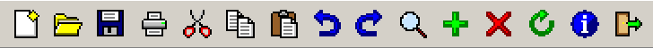
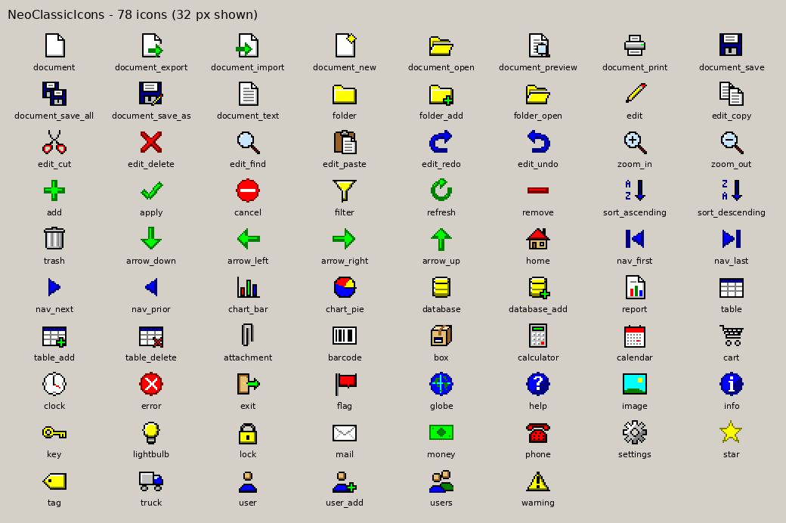
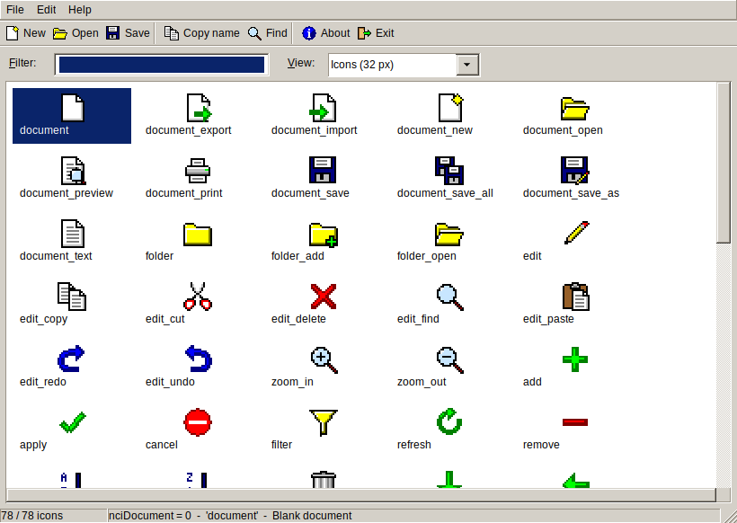
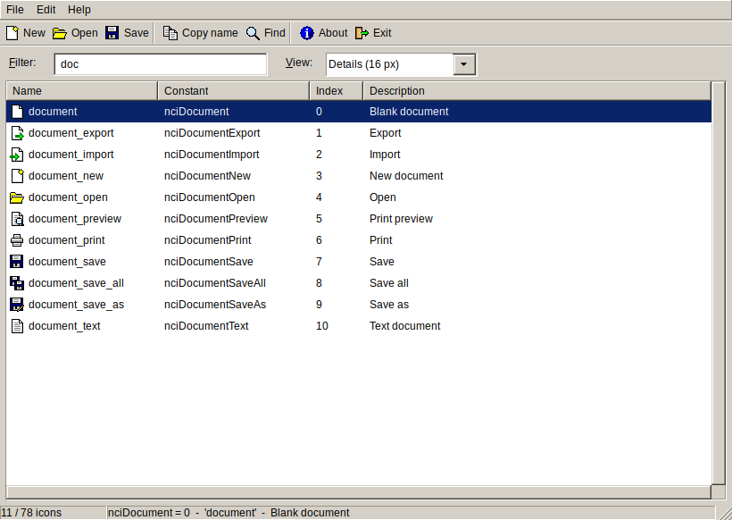

# NeoClassicIcons

**Classic 16×16 pixel-art icons for Lazarus**, in the spirit of Windows 9x/2000 and Delphi 7, plus a drop-in image list component.

[Türkçe](README.tr.md) · [Icon list](docs/ICONS.md) · [Contributing](CONTRIBUTING.md) · [Changelog](CHANGELOG.md)





## Features

- **78 icons** in six categories: file, edit, action, navigation, data and general application icons.
- **Pixel art in the classic 16-colour palette**, hand-made at 16×16, with pixel-doubled 32×32 versions so they stay crisp on HiDPI screens.
- **`TNeoClassicImageList`**: drop it on a form and all icons are already there. Choose them in the Object Inspector or use readable constants such as `nciDocumentSave`.
- **No image data in your `.lfm` files.** The icons are linked as resources, so forms stay small and diffs stay clean.
- **HiDPI aware.** The list provides 16, 24 and 32 px resolutions, so `Scaled` toolbars, menus and buttons pick a sharp size.
- **Stable indexes.** An icon's index never changes between releases, and new icons are only ever appended.
- **Optional classic theme.** On Linux/GTK2, the `NeoClassicTheme` unit gives your application the gray Windows 2000 look without touching the desktop theme.
- **Plain PNGs** in `icons/16` and `icons/32` for any other use.
- **MIT licensed.**

## Screenshots

The demo application, using the `NeoClassicTheme` unit on Linux/GTK2:





## Installation

Requirements: tested with Lazarus 3.0 and FPC 3.2.2. Older Lazarus versions have not been tested; multi-resolution image lists need at least Lazarus 2.0.

1. Clone or download this repository.
2. In Lazarus, choose **Package → Open Package File (.lpk)…** and open `package/neoclassicicons.lpk`.
3. Click **Compile**, then **Use → Install**, and let Lazarus rebuild the IDE.

After the restart you will find `TNeoClassicImageList` on the **NeoClassic** tab of the component palette.

**Using it without installing it in the IDE:** add `neoclassicicons` to your project in **Project → Project Inspector → Add → New Requirement**, then create the list in code (see below).

## Usage

### In the form designer

1. Drop a `TNeoClassicImageList` on the form. It already contains every icon.
2. Set it as `Images` of a `TToolBar`, `TMainMenu`, `TActionList`, `TBitBtn`, `TSpeedButton` or `TListView`, and pick icons through `ImageIndex` in the Object Inspector.
3. For 32 px icons at normal DPI, for example a large toolbar, set the list's `Width` and `Height` to 32.

### In code

```pascal
uses
  NeoClassicImageList, NeoClassicIconNames;

procedure TForm1.FormCreate(Sender: TObject);
begin
  Icons := TNeoClassicImageList.Create(Self);
  ToolBar1.Images := Icons;
  tbSave.ImageIndex := nciDocumentSave;
  tbPrint.ImageIndex := nciDocumentPrint;
  btnDelete.ImageIndex := Icons.IndexOfName('edit_delete');  // by name
end;
```

Other helpers in the package:

| Routine | Purpose |
|---|---|
| `NeoClassicLoadIcons(AnyImageList)` | Appends all icons to an existing `TImageList`, in `nciXxx` order if the list is empty. |
| `NeoClassicCreateIcon('folder_open', 32)` | Returns one icon as a `TPortableNetworkGraphic` (16 or 32 px). The caller frees it. |
| `NeoClassicIconIndex('folder_open')` | Returns the index for a name, or -1. |
| `NeoClassicIconList[i]`, `NeoClassicIconTitles[i]` | Name and description of each icon. |

### Classic Windows 2000 / Delphi 7 look (optional, GTK2)

List `NeoClassicTheme` **before** `Interfaces` in your `.lpr`:

```pascal
uses
  {$IFDEF UNIX} cthreads, {$ENDIF}
  NeoClassicTheme,   // must come before Interfaces
  Interfaces, Forms, Unit1;
```

The theme only affects your application, not the desktop. It gives gray `#D4D0C8` surfaces, navy selection, bevelled controls and yellow tooltips.

- The bevelled look comes from the `redmond95` engine in the `gtk2-engines` package. If that engine is missing, the colours are still applied.
- On Windows, Qt and Cocoa, and inside the Lazarus IDE, the unit does nothing.
- To switch it off at run time, set `NEOCLASSIC_THEME=0`.

## Building the icons

Every icon is a 16×16 text file in `src/`, one palette character per pixel. `tools/build.py` turns them into everything else:

```sh
python3 tools/build.py           # regenerate icons/, package/*.res, package/neoclassiciconnames.pas, docs/
python3 tools/build.py --check   # verify that the committed files match src/ (used by CI)
```

The generated files are committed, so **using the package does not require Python**. To add or change an icon, see [CONTRIBUTING.md](CONTRIBUTING.md).

## Repository layout

```
src/            icon sources (ASCII pixel art) + order.lst (index order)
icons/16, 32    generated PNGs
package/        Lazarus package: neoclassicicons.lpk and its units
examples/demo/  demo application that shows every icon
tests/          automated tests (run with a display, or xvfb-run)
tools/build.py  generator
docs/           icon list and images used by this README
```

## License

[MIT](LICENSE) © 2026 OpenLast. This covers both the icons and the code. Attribution is appreciated but not required beyond keeping the license notice.

The `NeoClassicTheme` style is adapted from the "Redmond" theme of gtk2-engines (LGPL). Only colour and size settings were reused, and the engine itself is loaded from the user's system.
