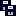
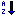
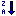
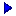
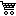
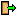
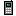
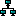

# Icon list

Generated by `tools/build.py`. Constants live in `package/neoclassiciconnames.pas`.

## File

| | Name | Constant | Index | Description |
|---|---|---|---|---|
|  | `document` | `nciDocument` | 0 | Blank document |
|  | `document_export` | `nciDocumentExport` | 1 | Export |
|  | `document_import` | `nciDocumentImport` | 2 | Import |
|  | `document_new` | `nciDocumentNew` | 3 | New document |
|  | `document_open` | `nciDocumentOpen` | 4 | Open |
|  | `document_preview` | `nciDocumentPreview` | 5 | Print preview |
|  | `document_print` | `nciDocumentPrint` | 6 | Print |
|  | `document_save` | `nciDocumentSave` | 7 | Save |
|  | `document_save_all` | `nciDocumentSaveAll` | 8 | Save all |
|  | `document_save_as` | `nciDocumentSaveAs` | 9 | Save as |
|  | `document_text` | `nciDocumentText` | 10 | Text document |
|  | `folder` | `nciFolder` | 11 | Folder |
|  | `folder_add` | `nciFolderAdd` | 12 | New folder |
|  | `folder_open` | `nciFolderOpen` | 13 | Open folder |

## Edit

| | Name | Constant | Index | Description |
|---|---|---|---|---|
|  | `edit` | `nciEdit` | 14 | Edit |
|  | `edit_copy` | `nciEditCopy` | 15 | Copy |
|  | `edit_cut` | `nciEditCut` | 16 | Cut |
|  | `edit_delete` | `nciEditDelete` | 17 | Delete |
|  | `edit_find` | `nciEditFind` | 18 | Find |
|  | `edit_paste` | `nciEditPaste` | 19 | Paste |
|  | `edit_redo` | `nciEditRedo` | 20 | Redo |
|  | `edit_undo` | `nciEditUndo` | 21 | Undo |
|  | `zoom_in` | `nciZoomIn` | 22 | Zoom in |
|  | `zoom_out` | `nciZoomOut` | 23 | Zoom out |

## Action

| | Name | Constant | Index | Description |
|---|---|---|---|---|
|  | `add` | `nciAdd` | 24 | Add |
|  | `apply` | `nciApply` | 25 | Apply / OK |
|  | `cancel` | `nciCancel` | 26 | Cancel |
|  | `filter` | `nciFilter` | 27 | Filter |
|  | `refresh` | `nciRefresh` | 28 | Refresh |
|  | `remove` | `nciRemove` | 29 | Remove |
|  | `sort_ascending` | `nciSortAscending` | 30 | Sort ascending |
|  | `sort_descending` | `nciSortDescending` | 31 | Sort descending |
|  | `trash` | `nciTrash` | 32 | Recycle bin |

## Navigation

| | Name | Constant | Index | Description |
|---|---|---|---|---|
|  | `arrow_down` | `nciArrowDown` | 33 | Down |
|  | `arrow_left` | `nciArrowLeft` | 34 | Left / Back |
|  | `arrow_right` | `nciArrowRight` | 35 | Right / Forward |
|  | `arrow_up` | `nciArrowUp` | 36 | Up |
|  | `home` | `nciHome` | 37 | Home |
|  | `nav_first` | `nciNavFirst` | 38 | First record |
|  | `nav_last` | `nciNavLast` | 39 | Last record |
|  | `nav_next` | `nciNavNext` | 40 | Next record |
|  | `nav_prior` | `nciNavPrior` | 41 | Prior record |

## Data

| | Name | Constant | Index | Description |
|---|---|---|---|---|
|  | `chart_bar` | `nciChartBar` | 42 | Bar chart |
|  | `chart_pie` | `nciChartPie` | 43 | Pie chart |
|  | `database` | `nciDatabase` | 44 | Database |
|  | `database_add` | `nciDatabaseAdd` | 45 | Add database |
|  | `report` | `nciReport` | 46 | Report |
|  | `table` | `nciTable` | 47 | Table |
|  | `table_add` | `nciTableAdd` | 48 | Add record |
|  | `table_delete` | `nciTableDelete` | 49 | Delete record |

## Application

| | Name | Constant | Index | Description |
|---|---|---|---|---|
|  | `attachment` | `nciAttachment` | 50 | Attachment |
|  | `barcode` | `nciBarcode` | 51 | Barcode |
|  | `box` | `nciBox` | 52 | Box / Product |
|  | `calculator` | `nciCalculator` | 53 | Calculator |
|  | `calendar` | `nciCalendar` | 54 | Calendar |
|  | `cart` | `nciCart` | 55 | Shopping cart |
|  | `clock` | `nciClock` | 56 | Clock |
|  | `error` | `nciError` | 57 | Error |
|  | `exit` | `nciExit` | 58 | Exit |
|  | `flag` | `nciFlag` | 59 | Flag |
|  | `globe` | `nciGlobe` | 60 | Internet |
|  | `help` | `nciHelp` | 61 | Help |
|  | `image` | `nciImage` | 62 | Image |
|  | `info` | `nciInfo` | 63 | Information / About |
|  | `key` | `nciKey` | 64 | Key |
|  | `lightbulb` | `nciLightbulb` | 65 | Tip |
|  | `lock` | `nciLock` | 66 | Lock |
|  | `mail` | `nciMail` | 67 | E-mail |
|  | `money` | `nciMoney` | 68 | Money |
|  | `phone` | `nciPhone` | 69 | Phone |
|  | `settings` | `nciSettings` | 70 | Settings |
|  | `star` | `nciStar` | 71 | Star / Favourite |
|  | `tag` | `nciTag` | 72 | Tag / Price |
|  | `truck` | `nciTruck` | 73 | Shipping |
|  | `user` | `nciUser` | 74 | User |
|  | `user_add` | `nciUserAdd` | 75 | Add user |
|  | `users` | `nciUsers` | 76 | Users |
|  | `warning` | `nciWarning` | 77 | Warning |

## File

| | Name | Constant | Index | Description |
|---|---|---|---|---|
|  | `folder_delete` | `nciFolderDelete` | 78 | Delete folder |

## Data

| | Name | Constant | Index | Description |
|---|---|---|---|---|
|  | `chart_line` | `nciChartLine` | 79 | Line chart |
|  | `database_delete` | `nciDatabaseDelete` | 80 | Delete database |

## Application

| | Name | Constant | Index | Description |
|---|---|---|---|---|
|  | `bell` | `nciBell` | 81 | Notification |
|  | `bookmark` | `nciBookmark` | 82 | Bookmark |
|  | `bug` | `nciBug` | 83 | Bug / Debug |
|  | `building` | `nciBuilding` | 84 | Company |
|  | `car` | `nciCar` | 85 | Vehicle |
|  | `chat` | `nciChat` | 86 | Chat / Comment |
|  | `cloud` | `nciCloud` | 87 | Cloud |
|  | `credit_card` | `nciCreditCard` | 88 | Credit card |
|  | `download` | `nciDownload` | 89 | Download |
|  | `eye` | `nciEye` | 90 | View |
|  | `gift` | `nciGift` | 91 | Gift |
|  | `heart` | `nciHeart` | 92 | Heart / Like |
|  | `hourglass` | `nciHourglass` | 93 | Wait |
|  | `link` | `nciLink` | 94 | Link |
|  | `location` | `nciLocation` | 95 | Location |
|  | `moon` | `nciMoon` | 96 | Night / Dark theme |
|  | `plugin` | `nciPlugin` | 97 | Plugin |
|  | `receipt` | `nciReceipt` | 98 | Receipt / Invoice |
|  | `shield` | `nciShield` | 99 | Security |
|  | `sun` | `nciSun` | 100 | Day / Light theme |
|  | `terminal` | `nciTerminal` | 101 | Terminal |
|  | `trophy` | `nciTrophy` | 102 | Trophy / Award |
|  | `upload` | `nciUpload` | 103 | Upload |
|  | `user_delete` | `nciUserDelete` | 104 | Delete user |
|  | `wallet` | `nciWallet` | 105 | Wallet |
|  | `wrench` | `nciWrench` | 106 | Tools |

## Device

| | Name | Constant | Index | Description |
|---|---|---|---|---|
|  | `battery` | `nciBattery` | 107 | Battery |
|  | `camera` | `nciCamera` | 108 | Camera |
|  | `cd` | `nciCd` | 109 | CD / DVD |
|  | `computer` | `nciComputer` | 110 | Computer |
|  | `hard_disk` | `nciHardDisk` | 111 | Hard disk |
|  | `keyboard` | `nciKeyboard` | 112 | Keyboard |
|  | `laptop` | `nciLaptop` | 113 | Laptop |
|  | `mobile_phone` | `nciMobilePhone` | 114 | Mobile phone |
|  | `monitor` | `nciMonitor` | 115 | Monitor |
|  | `mouse` | `nciMouse` | 116 | Mouse |
|  | `network` | `nciNetwork` | 117 | Network |
|  | `power` | `nciPower` | 118 | Power |
|  | `server` | `nciServer` | 119 | Server |
|  | `tv` | `nciTv` | 120 | Television |

## Media

| | Name | Constant | Index | Description |
|---|---|---|---|---|
|  | `headphones` | `nciHeadphones` | 121 | Headphones |
|  | `microphone` | `nciMicrophone` | 122 | Microphone |
|  | `music` | `nciMusic` | 123 | Music |
|  | `mute` | `nciMute` | 124 | Mute |
|  | `pause` | `nciPause` | 125 | Pause |
|  | `play` | `nciPlay` | 126 | Play |
|  | `record` | `nciRecord` | 127 | Record |
|  | `stop` | `nciStop` | 128 | Stop |
|  | `video` | `nciVideo` | 129 | Video |
|  | `volume` | `nciVolume` | 130 | Volume |

## Format

| | Name | Constant | Index | Description |
|---|---|---|---|---|
|  | `align_center` | `nciAlignCenter` | 131 | Center |
|  | `align_left` | `nciAlignLeft` | 132 | Align left |
|  | `align_right` | `nciAlignRight` | 133 | Align right |
|  | `color_palette` | `nciColorPalette` | 134 | Colour palette |
|  | `font` | `nciFont` | 135 | Font |
|  | `list_bullet` | `nciListBullet` | 136 | Bulleted list |
|  | `paint_brush` | `nciPaintBrush` | 137 | Paint brush |
|  | `text_bold` | `nciTextBold` | 138 | Bold |
|  | `text_italic` | `nciTextItalic` | 139 | Italic |
|  | `text_underline` | `nciTextUnderline` | 140 | Underline |
